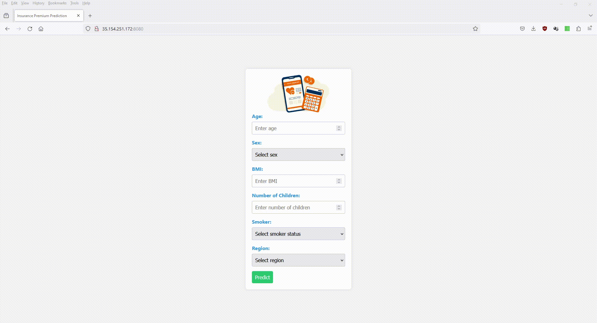

# Insurance Premium Prediction

## Overview

This project aims to predict insurance premiums based on various factors such as age, sex, BMI, number of children, smoking habits, and region. It utilizes machine learning algorithms to analyze historical data and make predictions on future insurance premiums.

## Web UI



## Deployment Link

http://ec2-15-207-100-231.ap-south-1.compute.amazonaws.com:8080/

## Table of Contents

- [Dataset](#dataset)
- [Prerequisites](#prerequisites)
- [Usage](#usage)
- [Deployment](#deployment)


## Dataset

The dataset used in this project contains the following columns:

- `age`: Age of the insured.
- `sex`: Gender of the insured (male or female).
- `bmi`: Body Mass Index (BMI) of the insured.
- `children`: Number of children or dependents covered by the insurance.
- `smoker`: Smoking status of the insured (yes or no).
- `region`: Geographic region of the insured.
- `expenses`: Insurance expenses (target variable).

## Prerequisites

Before running the code in this project, you will need to have the following packages installed:
```
pandas
numpy
scikit-learn
flask
joblib
```

## Usage

- Python 3.x

- Environment setup

    ```
    conda create -n <env_name> python=3.8 -y 

    conda activate venv/
    ```

- Install required Python packages:
  ```bash
  pip install -r requirements.txt

- Run Application
    ```
    Python app.py
    ```

## Deployment

### AWS Continuous Integration and Continuous Delivery (CI/CD) pipeline using GitHub Actions
```
1. Login to AWS console.
2. Create IAM user for deployment

With specific access to
1. EC2  
2. ECR: Elastic Container registry to save your docker image in aws


Description: About the deployment

1. Build docker image of the source code
2. Push your docker image to ECR
3. Launch Your EC2 
4. Pull Your image from ECR in EC2
5. Lauch your docker image in EC2

Policy:

1. AmazonEC2ContainerRegistryFullAccess
2. AmazonEC2FullAccess
3. Create ECR repo to store/save docker image

- Save the URI: 

4. Create EC2 machine (Ubuntu)
5. Open EC2 and Install docker in EC2 Machine:

#optinal

sudo apt-get update -y
sudo apt-get upgrade

#required

curl -fsSL https://get.docker.com -o get-docker.sh
sudo sh get-docker.sh
sudo usermod -aG docker ubuntu
newgrp docker

6. Configure EC2 as self-hosted runner:

setting>actions>runner>new self hosted runner> choose os> then run command one by one

7. Setup github secrets:

AWS_ACCESS_KEY_ID=
AWS_SECRET_ACCESS_KEY=
AWS_REGION = 
AWS_ECR_LOGIN_URI = 
ECR_REPOSITORY_NAME = 

```

## Documentation

[High Level Design Document (HLD)](Documentation\High_Level_Design_Document.pdf)

[Low Level Design Document (LLD)](Documentation\Low_Level_Design.pdf)

[Architecture](Documentation\Architecture.pdf)

[WireFrame](Documentation\wireframe.pdf)

[Detailed Project Report (DPR)](Documentation\Insurance_Premium_Prediction_DPR.pptx)

